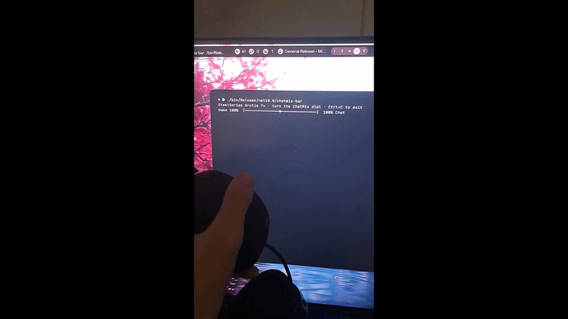

# ChatMix Bar

A small terminal application that turns the headset ChatMix dial into a live
game/chat balance bar:

```text
Game 100%  [───────────────◆───────────────]  100% Chat
```



## Run

From the repository root:

```bash
cargo run --release --package chatmix-bar
```

Turn the ChatMix dial to move the marker. Press Ctrl+C to exit.

## Requirements

- The Rust toolchain pinned by `rust-toolchain.toml`
- A supported SteelSeries headset with ChatMix
- Permission to access its HID endpoints


The example selects the first connected headset advertising the ChatMix
capability. It displays an error and exits when no compatible headset is found.
