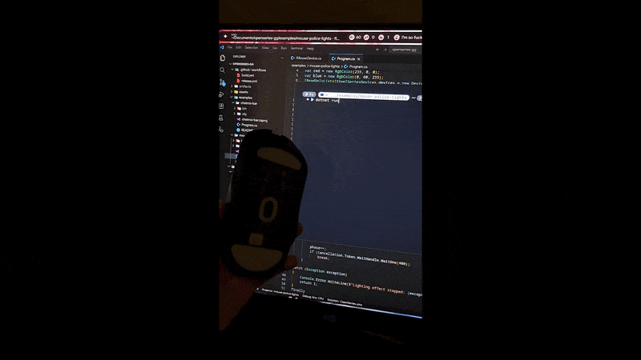

# Mouse Police Lights

A red-and-blue lighting effect for supported SteelSeries mice. The example
discovers the mouse's available illumination zones and automatically alternates
the two colors across them:

```text
Top: red · Middle: blue · Bottom: red
Top: blue · Middle: red · Bottom: blue
```

The animation uses transient lighting writes, so each frame is not saved to the
mouse's onboard configuration.



## Run

From the repository root:

```bash
dotnet run --project examples/mouse-police-lights
```

Press Ctrl+C to stop. The final colors may remain active until another lighting
setting is applied or the mouse reloads its saved configuration.

## Requirements

- .NET 10 SDK
- A supported SteelSeries mouse with controllable illumination
- Permission to access its HID endpoints
